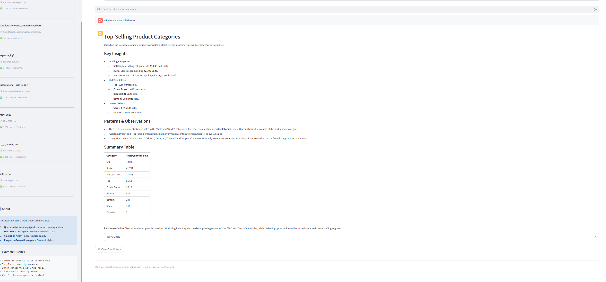
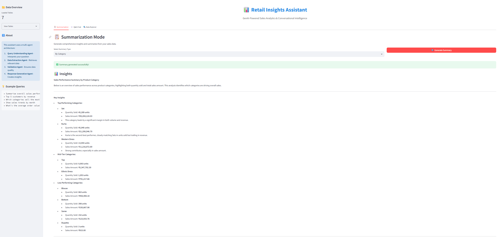
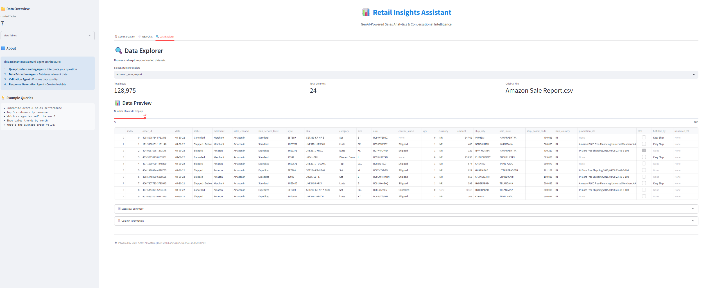

# 📊 Retail Insights Assistant

**GenAI-Powered Multi-Agent System for Sales Analytics**

An intelligent retail analytics assistant that uses a multi-agent architecture to analyze large-scale sales data, generate automated insights, and answer business questions in natural language.


---

## 🎯 Features

### Core Capabilities
- **🤖 Multi-Agent Architecture**: Intelligent agent orchestration using LangGraph
  - Query Understanding Agent - Interprets natural language
  - Data Extraction Agent - Generates and executes SQL queries
  - Validation Agent - Ensures data quality
  - Response Generation Agent - Creates business insights

- **📋 Summarization Mode**: Generate comprehensive business insights
  - Overall performance summaries
  - Category-wise analysis
  - Time-series trends
  - Top performer identification

- **💬 Conversational Q&A**: Ask questions in natural language
  - "What are the top 5 customers by revenue?"
  - "Which categories saw the highest growth last quarter?"
  - "Show me monthly sales trends"
  - Maintains conversation context

- **🔍 Data Explorer**: Interactive data browsing
  - View all loaded datasets
  - Statistical summaries
  - Column information
  - Data preview

### Technical Highlights
- **Efficient Querying**: DuckDB for fast in-memory SQL operations
- **Scalable Architecture**: Designed to handle 100GB+ datasets
- **LLM Integration**: OpenAI GPT-4 / Google Gemini support
- **Interactive UI**: Beautiful Streamlit interface
- **Cost Optimized**: Prompt caching and minimal token usage

---

## 🏗️ Architecture

### Multi-Agent System Flow

```
User Query
    ↓
┌─────────────────────────────────────────┐
│   Query Understanding Agent              │
│   • Interprets natural language         │
│   • Identifies intent and requirements  │
│   • Maps to data schema                 │
└─────────────────┬───────────────────────┘
                  ↓
┌─────────────────────────────────────────┐
│   Data Extraction Agent                  │
│   • Generates optimized SQL queries     │
│   • Executes against DuckDB             │
│   • Retrieves relevant data             │
└─────────────────┬───────────────────────┘
                  ↓
┌─────────────────────────────────────────┐
│   Validation Agent                       │
│   • Checks data quality                 │
│   • Validates results                   │
│   • Identifies anomalies                │
└─────────────────┬───────────────────────┘
                  ↓
┌─────────────────────────────────────────┐
│   Response Generation Agent              │
│   • Creates natural language response   │
│   • Generates insights                  │
│   • Formats results                     │
└─────────────────┬───────────────────────┘
                  ↓
            Final Response
```


## 🚀 Quick Start

### Prerequisites
- Python 3.9 or higher
- OpenAI API key (or Google Gemini API key)
- 4GB+ RAM recommended

### Installation

1. **Clone or download the project**
   ```bash
   cd sales_agent
   ```

2. **Create virtual environment**
   ```bash
   # Windows
   python -m venv venv
   .\venv\Scripts\activate

   # macOS/Linux
   python3 -m venv venv
   source venv/bin/activate
   ```

3. **Install dependencies**
   ```bash
   pip install -r requirements.txt
   ```

4. **Configure environment variables**
   ```bash
   # Copy the example file
   cp .env.example .env

   # Edit .env and add your API key
   # OPENAI_API_KEY=
   ```

5. **Verify your data**
   - Ensure your CSV files are in the `Sales Dataset/` folder
   - The system will automatically load all CSV files from this directory

### Running the Application

```bash
# Navigate to src directory
cd src

# Run Streamlit app
streamlit run app.py
```

The application will open in your browser at `http://localhost:8501`

---

## 📖 Usage Guide

### Mode 1: Summarization

1. Navigate to the **"📋 Summarization"** tab
2. Select a summary type:
   - Overall Performance
   - By Category
   - By Time Period
   - Top Performers
   - Custom Summary
3. Click **"🔍 Generate Summary"**
4. View comprehensive insights and underlying data

**Example Output:**
```
📊 Overall Sales Performance Summary

Key Metrics:
• Total Revenue: $2,458,392
• Total Transactions: 37,434
• Average Order Value: $65.67
• Unique Customers: 1,245

Top Insights:
✓ Revenue grew 23% compared to previous period
✓ 'Kurta' category leads with 34% of total sales
✓ Top customer: REVATHY LOGANATHAN ($45,230)
```

### Mode 2: Conversational Q&A

1. Navigate to the **"💬 Q&A Chat"** tab
2. Type your question in natural language
3. The multi-agent system will:
   - Understand your intent
   - Query the data
   - Validate results
   - Generate insights
4. View responses with supporting data and visualizations

**Example Queries:**
```
✅ "What are the top 5 products by sales?"
✅ "Show me monthly revenue trends"
✅ "Which customer spent the most?"
✅ "Compare sales between different categories"
✅ "What's the average transaction value by region?"
✅ "Which month had the highest sales?"
```

### Mode 3: Data Explorer

1. Navigate to the **"🔍 Data Explorer"** tab
2. Select a table from the dropdown
3. View:
   - Row/column counts
   - Data preview
   - Statistical summary
   - Column information
4. Adjust the number of rows to display

---

## 🧪 Testing

### Test the Data Manager

```bash
cd src
python data_manager.py
```

Expected output:
```
=== Loaded Tables ===
- international_sale_report
- sale_report
- may_2022
- p_l_march_2021
...

=== Auto-generated Insights ===
international_sale_report:
  - Total gross_amt: 24,583,920.00
  - Total pcs: 37,434
```

### Test the Agent System

```bash
cd src
python agents.py
```

This will run a test query and show the multi-agent workflow in action.

### Test the Full Application

```bash
cd src
streamlit run app.py
```

Try these test queries:
1. "Summarize overall sales performance"
2. "Who are the top 10 customers?"
3. "What categories have the most inventory?"
4. "Show me sales by month"

---

## 📊 Sample Queries & Expected Results

### Query 1: Top Customers
**Input:** "Who are the top 5 customers by total purchase amount?"

**Agent Process:**
```
1. Query Understanding: Identify need for customer aggregation
2. Data Extraction: Generate SQL with GROUP BY and ORDER BY
3. Validation: Check for valid customer data
4. Response: Format top 5 with amounts and percentages
```

### Query 2: Category Analysis
**Input:** "Which product categories sell the most?"

**Agent Process:**
```
1. Query Understanding: Recognize category-level aggregation
2. Data Extraction: Sum sales by category
3. Validation: Ensure all categories included
4. Response: Rank categories with insights
```

### Query 3: Trend Analysis
**Input:** "Show me sales trends over the last 6 months"

**Agent Process:**
```
1. Query Understanding: Identify time-series analysis need
2. Data Extraction: Group by month with date filtering
3. Validation: Check date ranges and continuity
4. Response: Describe trend (growing/declining/stable)
```

---

## 🎨 Screenshots

### Main Dashboard



### Summarization Mode


### Q&A Mode


### Data Explorer


---

## 🔧 Configuration

### Environment Variables

Create a `.env` file with:

```env
# OpenAI Configuration
OPENAI_API_KEY=your-openai-api-key-here

# Alternative: Google Gemini
# GOOGLE_API_KEY=your-gemini-api-key

# Model Selection
MODEL_NAME=gpt-4  # or gpt-3.5-turbo for cost savings

# Optional: LangChain Tracing
# LANGCHAIN_TRACING_V2=true
# LANGCHAIN_API_KEY=your-langchain-key
```

### Customizing the Data Path

Edit `src/app.py` line 35:
```python
data_dir = Path(__file__).parent.parent / "Sales Dataset"
# Change to your data directory
```

### Model Selection

For cost optimization, edit `src/app.py` line 51:
```python
agent_system = MultiAgentSystem(dm, api_key, model="gpt-3.5-turbo")
```

Model comparison:
- **GPT-4**: Best accuracy, higher cost ($0.03/1K tokens)
- **GPT-3.5-Turbo**: Good accuracy, lower cost ($0.002/1K tokens)
- **Gemini Pro**: Competitive, different pricing

---


## 📄 License

This project is provided as-is for educational and commercial use.

---

## 👤 Author

**Retail Insights Assistant**  
Built with ❤️ using LangGraph, OpenAI, and Streamlit

---

**Ready to get insights from your data? Let's get started! 🚀**

```bash
cd src
streamlit run app.py
```
